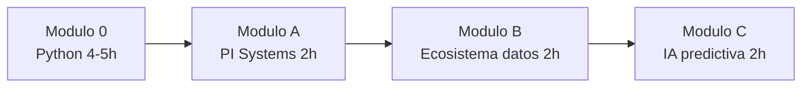

# Mapa del curso — Minería 5.0 + PI System

**Para:** ingenieros de mantenimiento y operaciones de plantas concentradoras.

**Tiempo total guiado:** ~10–11 horas (prerequisito Python + 6 h de módulos centrales).

---

## Por qué existe este curso

Hoy muchos equipos de mantenimiento trabajan así:

1. Exportan datos de sensores a Excel.
2. Calculan indicadores a mano o con fórmulas.
3. Detectan problemas **después** de que el equipo ya falló.

Este curso te lleva hacia **Minería 5.0**: usar los datos de planta de forma sistemática para **anticipar fallas**, priorizar intervenciones y tomar mejores decisiones.

No necesitas ser programador. Si usas Excel en planta, ya tienes la base.

---

## Qué es Minería 5.0 (en una frase)

**Conectar lo que pasa en planta (sensores, bombas, molinos) con herramientas de análisis (Python, bases de datos, dashboards, inteligencia artificial).**

En el curso lo verás con un caso real simulado: la bomba de alimentación **PUMP101** en una línea de molienda.

---

## El viaje del dato (visión general)

Así viaja la información desde el sensor hasta una alerta de mantenimiento:

```
Sensor → PLC → Historiador PI → Python (limpieza) → Base de datos → Dashboard → Alerta
```

| Paso | Qué pasa | Herramienta del curso |
|------|----------|----------------------|
| 1 | El sensor mide vibración, temperatura, presión | Concepto (planta) |
| 2 | El PLC registra el valor cada segundo | Concepto (OT) |
| 3 | PI System guarda el historial | Labs Módulo A |
| 4 | Python limpia y transforma los datos | Módulo 0 y B |
| 5 | Los datos se consultan y almacenan | SQL / Supabase (Módulo B) |
| 6 | Un dashboard muestra tendencias | Power BI (Módulo B) |
| 7 | Un modelo detecta riesgo de falla | ML / IA (Módulo C) |

Verás cada paso **en el momento adecuado**, cuando ya tengas las herramientas para entenderlo.

---

## Las 4 etapas del curso



### Etapa 0 — Python desde cero (prerequisito, ~4–5 h)

**Carpeta:** [`00_python_para_ingenieros/`](00_python_para_ingenieros/)

**Qué aprenderás:** variables, condicionales, bucles, funciones, leer un CSV y hacer un gráfico básico.

**Por qué primero:** Sin Python no puedes procesar miles de lecturas de sensores ni automatizar reportes. Es el equivalente a dominar fórmulas avanzadas en Excel, pero con escala industrial.

**Guía previa:** [`GUIA_00_antes_de_empezar.md`](00_python_para_ingenieros/GUIA_00_antes_de_empezar.md)

---

### Etapa A — Integración PI Systems (2 h)

**Carpetas:** Labs `01_` a `04_` · Guía docente: [`01_PI_systems/`](01_PI_systems/)

**Qué aprenderás:** leer exports del historiador PI, mapear tags a equipos (Asset Framework), modelar KPIs en Excel y calcular MTBF/MTTR.

**Analogía:** PI System es el "Excel gigante" de la planta — guarda millones de lecturas de sensores con fecha y hora.

---

### Etapa B — Ecosistema de datos Minería 5.0 (2 h)

**Carpeta:** [`04_ecosistema_datos/`](04_ecosistema_datos/)

**Qué aprenderás:**

- OT vs IT y modelo Purdue (capas tecnológicas de la planta)
- Flujo de datos desde sensor hasta dashboard
- SQL para consultar historial
- Pipeline Python: PI → limpieza → almacenamiento → Power BI

**Aquí entra "Big Data":** no como moda, sino como **volumen y velocidad** de datos de sensores que Excel no puede manejar solo. Lo verás con datos reales simulados de PUMP101.

---

### Etapa C — IA predictiva de fallas (2 h)

**Carpeta:** [`05_ia_predictiva/`](05_ia_predictiva/)

**Qué aprenderás:**

- Escalera de mantenimiento: reactivo → preventivo → predictivo → prescriptivo
- Clasificar si un equipo está cerca de fallar (machine learning)
- Detectar anomalías y estimar vida útil restante (RUL)
- Priorizar alertas con criterio de riesgo

**Aquí entra ML/IA:** solo **después** de que sepas leer datos, calcular variables y entender gráficos. No se adelanta en el Módulo 0.

---

## Qué NO verás al inicio (y está bien)

| Tema | Cuándo lo verás |
|------|-----------------|
| Big Data | Módulo B (con datos de planta en mano) |
| Machine Learning | Módulo C (después de Python y PI) |
| SQL y Supabase | Módulo B |
| Modelo Purdue completo | Módulo B, notebook IV_01 |
| Weibull, vibración avanzada | Labs opcionales 05–08 |

---

## Profundización opcional (después del curso)

| Lab | Tema |
|-----|------|
| 05 | Análisis Weibull de confiabilidad |
| 06 | Vibración predictiva (ISO 10816) |
| 07 | Machine learning multivariable |
| 08 | IA de mantenimiento con RUL y Pareto |

---

## Sesión 0 recomendada (con instructor, ~45 min)

Antes de abrir Python, dedica una sesión a:

1. **Guía Colab e internet** — [`GUIA_00_antes_de_empezar.md`](00_python_para_ingenieros/GUIA_00_antes_de_empezar.md)
2. **Este mapa** — entender el recorrido completo
3. **Práctica en vivo** — abrir Colab, subir `00_01`, ejecutar una celda

---

## Material de referencia durante todo el curso

- **Glosario planta ↔ tecnología:** [`GLOSARIO_PLANTA_TECNOLOGIA.md`](GLOSARIO_PLANTA_TECNOLOGIA.md)
- **Guía del Módulo 0:** [`00_python_para_ingenieros/README_modulo0.md`](00_python_para_ingenieros/README_modulo0.md)
- **README principal:** [`README.md`](README.md)

---

## Criterio de éxito al terminar

Al completar el curso podrás:

1. Leer y limpiar datos exportados del historiador PI con Python.
2. Explicar cómo fluye un dato desde el sensor hasta un dashboard.
3. Interpretar una alerta predictiva de vibración o temperatura en PUMP101.
4. Priorizar intervenciones de mantenimiento con criterio basado en datos.
